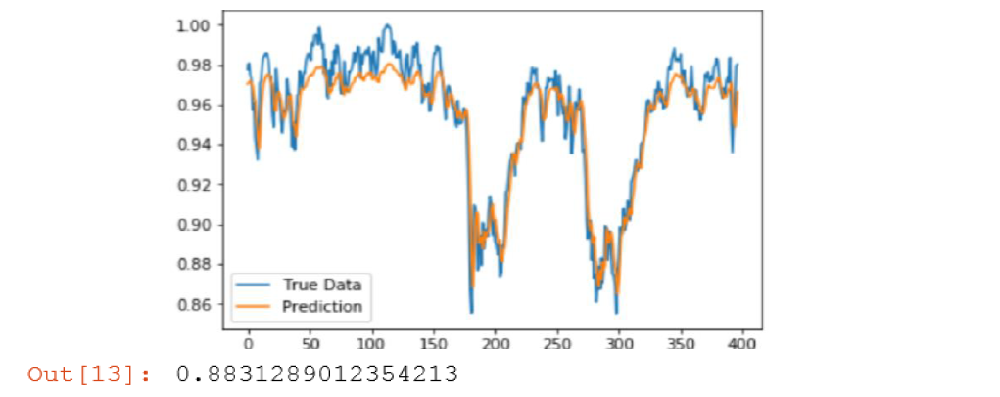
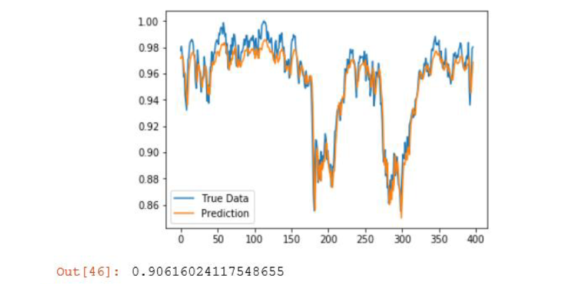
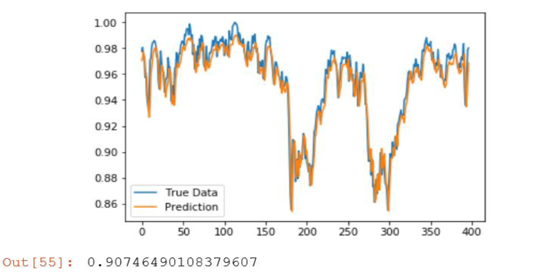
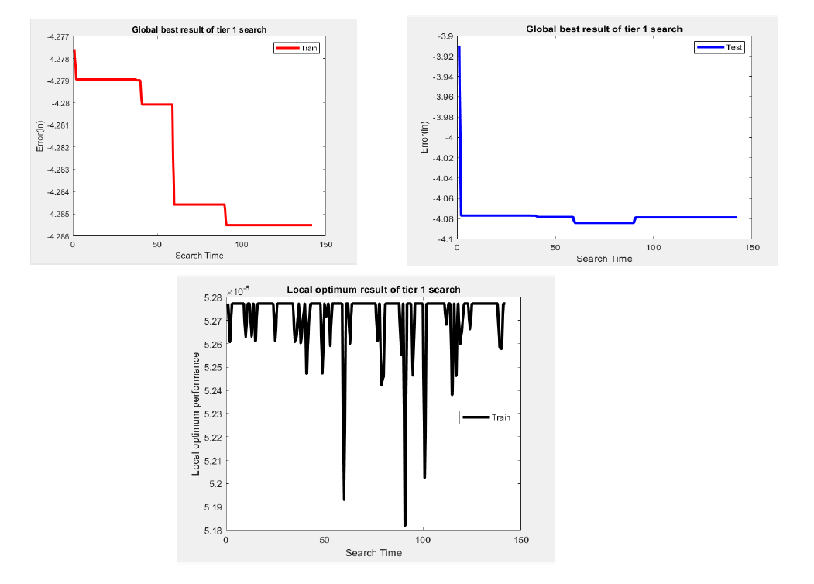

# Stock forestcasting based on News Article Headlines and TRUST-TECH Optmization 

* In practice, the real-world events always matter and always have a strong correlation with the stock movement. The stock movement of associate company might be helpful to incorporate some of impacts of the real-world event and therefore improving the prediction accuracy.
I select four associated company stocks from Yahoo Finance including: General Electronic, ABB, SIMENS, Honeywell. The dataset contains four company’s stock prices from 2015-03-15 to 2017-3-15. The prediction stock is the GE stock, the target is its closing prices. The input to the model contains: previous 4 days’ closing prices for the predicting company GE and previous 4 days’ closing prices for ABB, SIMENS, HoneyWell.

* Also,I introduced another predictor extracted from news title. I tried to demonstrate the effectiveness of using textual information combined with numerical information to build models. Specifically, I mainly focused on the methods of extracting the textual information from news instead of the numerical information like daily price. I was looking at a method of extracting textual information called sentiment analysis, which looks at positive and negative sentiments of the title and based on that it gives a quantitative indication on the market stock price. The stock dataset chosen for this section are the Dow Jones Industrial Average (DJIA) stock. 

# Preproces of news headlines

The news title article will essentially be transformed into some format of numerical numbers. Therefore, some preprocessing has to be done on the original dataset.
1. The top 25 news for each day is concatenated into a long vector containing all the news
text.
2. The previous 3 days’ news are concatenated together, assigned as a new predictor for the next day.
3. Some redundant punctuation mark within each title should be deleted since it is irreverent to the context.

After processing, we end up a very long vector containing 75 news for each day.

# Result：
The model is a simple 3-layer ANN model with 128 hidden layers. The training parameters are set as follow: activation using Sigmoid, learning rate as 0.001, Adam optimizer.

The model result of using only the price information, having an R2 score of <b>0.883</b>.

The model result of using price information and the daily top 25 news, having an R2 score of <b>0.905</b>

Figure 5.6 The model result of using price information and the daily top 5 news, having an R2 score of <b>0.908</b>

# TRUST-TECH Optmization
The model I built takes 5 inputs (3 days’ of stock closing prices and two sentiment scores) and a hidden layer of 20 neurons and 1 output neuron. Therefore, we end up 5*20+20+20+1=141 directions and 141 local minimums. Among these local optimums, the one yields best performance is consider as my global optimum solution.
I split the dataset into training and testing set (ratio 4:1). For each local minimum, I computed its training error obtained by trust-tech and the associated test error. Additionally, the weight is initialized using random number generation (in range of (-0.01 to 0.01)).

Several implications can be drawn from the above figure:
1. The trust-tech improves the original trained model that the global optimum solution obtained at the end yield a reduced training error
2. Different run of the model gives different result, it is because of the different weight initialization
3. From the black curve, we can see sometimes, the local minimums obtained from different directions give the same result.
4. At the end of tier-1 search, the global optimum solution gives the lowest training error, yet the test error with that solution might not be the lowest. Some other local minimum that gives the higher training error might result in a lower test accuracy.